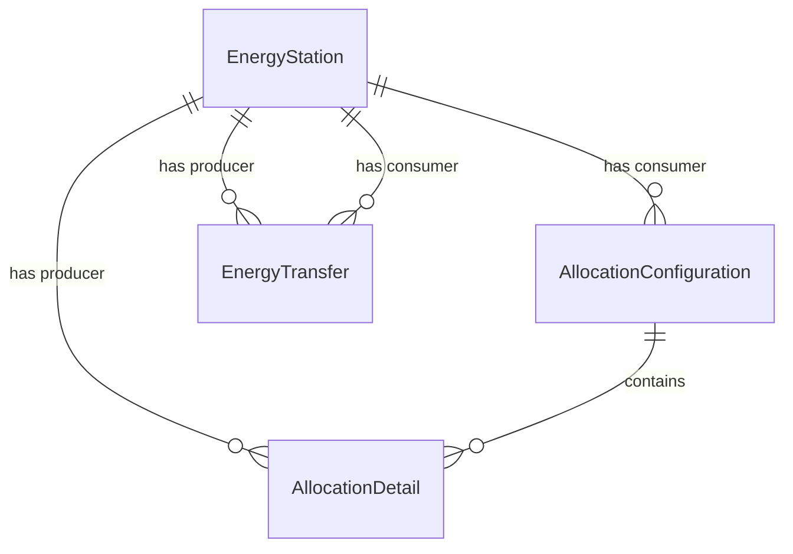

# Improved Data Model for Energy Station Management System

This document outlines the design for an improved data model for the energy station management system, based on the analysis of existing CSV data and system requirements.

## 1. Core Entities and their Properties

The following core entities are proposed:

*   **`EnergyStation`**: Represents a unique energy point (producer or consumer).
    *   `EAN`: `string` (Primary Key, unique identifier for the energy station)
    *   `Type`: `enum` (`EnergyStationType.Producer` or `EnergyStationType.Consumer`)
    *   `Description`: `string` (Optional, for human-readable name/description)

*   **`TimePeriod`**: A value object or struct to encapsulate date ranges.
    *   `StartDate`: `DateTime`
    *   `EndDate`: `DateTime?` (Nullable, to handle indefinite end dates like `31.12.9999`)

*   **`AllocationConfiguration`**: Represents a specific "Skupina Sdileni" (sharing group) configuration valid for a `TimePeriod`.
    *   `Id`: `string` (Corresponds to `IdSkupinySdileni` from CSV, primary key)
    *   `ConsumerEAN`: `string` (Foreign Key to `EnergyStation.EAN`, representing the consumption point for this configuration)
    *   `ValidPeriod`: `TimePeriod` (Embeds `StartDate` and `EndDate` for configuration validity)
    *   `OperationType`: `enum` (`AllocationOperationType.New`, `AllocationOperationType.Edit`, `AllocationOperationType.End`, `AllocationOperationType.Cancel`)
    *   `Details`: `List<AllocationDetail>` (Collection of individual allocations within this configuration)

*   **`AllocationDetail`**: Represents a single allocation percentage from a producer to a consumer within an `AllocationConfiguration`.
    *   `ProducerEAN`: `string` (Foreign Key to `EnergyStation.EAN`, representing the production point)
    *   `AllocationPercentage`: `decimal` (Represents the percentage, e.g., 0.25 for 25%)

*   **`EnergyTransfer`**: Represents a single time-series data point for energy transfer between a producer and a consumer.
    *   `Timestamp`: `DateTime` (Combines `Datum`, `Cas od` for the start of the 15-minute interval. Note: The time period for each entry is fixed at 15 minutes as per architectural specification.)
    *   `ProducerEAN`: `string` (Foreign Key to `EnergyStation.EAN`)
    *   `ConsumerEAN`: `string` (Foreign Key to `EnergyStation.EAN`)
    *   `Value`: `decimal` (The energy transfer value for that interval)

## 2. Entity Relationship Diagram (Textual Description)



**Explanation of Relationships:**

*   An `EnergyStation` can be a `Consumer` for many `AllocationConfiguration` entries.
*   An `EnergyStation` can be a `Producer` for many `AllocationDetail` entries.
*   An `EnergyStation` can be a `Producer` or `Consumer` in many `EnergyTransfer` records.
*   An `AllocationConfiguration` contains one or more `AllocationDetail` entries, defining how energy from various producers is allocated to a specific consumer.

## 3. Class Definitions with Properties (C#)

```csharp
// Enums for clarity and type safety
public enum EnergyStationType
{
    Producer,
    Consumer
}

public enum AllocationOperationType
{
    New,
    Edit,
    End,
    Cancel // Corresponds to "Ukonceni" and "Zrusit" if distinct
}

// Value object for time periods
public record TimePeriod
{
    public DateTime StartDate { get; init; }
    public DateTime? EndDate { get; init; } // Nullable for indefinite end dates
}

public class EnergyStation
{
    public string EAN { get; init; } = string.Empty; // Primary Key
    public EnergyStationType Type { get; init; }
    public string? Description { get; init; } // Optional
}

public class AllocationConfiguration
{
    public string Id { get; init; } = string.Empty; // Corresponds to IdSkupinySdileni
    public string ConsumerEAN { get; init; } = string.Empty; // FK to EnergyStation
    public TimePeriod ValidPeriod { get; init; } = new();
    public AllocationOperationType OperationType { get; init; }
    public List<AllocationDetail> Details { get; init; } = new();
}

public class AllocationDetail
{
    public string ProducerEAN { get; init; } = string.Empty; // FK to EnergyStation
    public decimal AllocationPercentage { get; init; } // e.g., 0.25 for 25%
}

public class EnergyTransfer
{
    public DateTime Timestamp { get; init; } // Combines Date and Time
    public string ProducerEAN { get; init; } = string.Empty; // FK to EnergyStation
    public string ConsumerEAN { get; init; } = string.Empty; // FK to EnergyStation
    public decimal Value { get; init; } // Energy transfer value
}
```

## 4. Loading Strategy from CSV Files

This strategy assumes an in-memory loading for demonstration. For a persistent solution, a database layer would be integrated.

**General Principles:**

*   Use a robust CSV parsing library (e.g., CsvHelper in C#).
*   Handle culture-specific decimal separators (comma in provided samples) and semicolon delimiters.
*   Handle date/time parsing with specific formats (`DD.MM.YYYY`, `HH:mm`).
*   Maintain a collection of `EnergyStation` objects to ensure uniqueness and proper type assignment.

**Loading `Export-odberovych-EAN-*.csv` (Configuration Report):**

1.  Read the CSV file line by line, skipping the header.
2.  For each row:
    *   Parse `IdSkupinySdileni` into `AllocationConfiguration.Id`.
    *   Parse `EANo` into `AllocationConfiguration.ConsumerEAN`.
        *   Add `EANo` to `EnergyStation` collection as `EnergyStationType.Consumer` if not already present.
    *   Parse `DatumOd` and `DatumDo` into `DateTime` objects for `TimePeriod.StartDate` and `TimePeriod.EndDate`.
        *   If `DatumDo` is `31.12.9999`, set `EndDate` to `null`.
    *   Map `Operace` to `AllocationOperationType` enum.
    *   Initialize an `AllocationConfiguration` object.
    *   Iterate from `i = 1` to `5` (for `EANdX` and `AlokacniKlicX`):
        *   Get `EANd` (producer EAN) and `AlokacniKlic` (allocation percentage string).
        *   If `EANd` is not empty/whitespace:
            *   Parse `AlokacniKlic` into a `decimal` (e.g., `Convert.ToDecimal(value.Replace(',', '.'), CultureInfo.InvariantCulture)`).
            *   Create an `AllocationDetail` with `ProducerEAN` and `AllocationPercentage`.
            *   Add `EANd` to `EnergyStation` collection as `EnergyStationType.Producer` if not already present.
            *   Add the `AllocationDetail` to `AllocationConfiguration.Details`.
    *   Add the populated `AllocationConfiguration` to a list of configurations.

**Loading `Export-dat-*.csv` (Time-Series Report):**

1.  Read the CSV file line by line, skipping the header.
2.  Parse the header row to identify EAN pairs (e.g., `ProducerEAN-ConsumerEAN`) and their column indices.
    *   For each EAN pair in the header:
        *   Split the string by `-` to get `ProducerEAN` and `ConsumerEAN`.
        *   Add `ProducerEAN` to `EnergyStation` collection as `EnergyStationType.Producer` if not already present.
        *   Add `ConsumerEAN` to `EnergyStation` collection as `EnergyStationType.Consumer` if not already present.
3.  For each data row:
    *   Parse `Datum`, `Cas od` into a single `DateTime` for `EnergyTransfer.Timestamp`.
    *   For each identified EAN pair column:
        *   Get the `ProducerEAN` and `ConsumerEAN` from the pre-parsed header information.
        *   Parse the cell value into a `decimal` for `EnergyTransfer.Value` (handling comma as decimal separator).
        *   Create an `EnergyTransfer` object.
        *   Add the `EnergyTransfer` to a list of transfers.

## 5. Migration Approach from Current `SkupinaSdileni` Model

To migrate from the existing `SkupinaSdileni` model to the new one:

1.  **Iterate through `SkupinaSdileni` objects**: For each `SkupinaSdileni` instance:
    *   **Create `AllocationConfiguration`**:
        *   `Id` will be `SkupinaSdileni.Id`.
        *   `ConsumerEAN` will be the `EAN` of the first `ConsumptionEan` in `SkupinaSdileni.ConsumptionEans` (assuming one consumer per group based on CSV structure).
        *   `ValidPeriod` will need to be derived from the `DatumOd` and `DatumDo` fields that were originally used to populate `SkupinaSdileni` (these are not directly part of the `SkupinaSdileni` class itself, but were in the source CSV). If this information is not available, a default or "unknown" period would be used.
        *   `OperationType` would also need to be derived from the original CSV data. If not available, a default like `AllocationOperationType.Edit` could be used.
    *   **Populate `AllocationDetails`**:
        *   For each `ProductionEan` in `SkupinaSdileni.ProductionEans`:
            *   For each `Allocation` in `ProductionEan.Allocations`:
                *   Create an `AllocationDetail` object.
                *   `ProducerEAN` will be `ProductionEan.EAN`.
                *   `AllocationPercentage` will be `Allocation.AllocationPercent / 100.0m` (converting back to a decimal percentage).
                *   Add this `AllocationDetail` to the `Details` list of the `AllocationConfiguration`.
    *   **Populate `EnergyStation` entities**: As `SkupinaSdileni` objects are processed, extract all unique `EAN`s from `ConsumptionEans` and `ProductionEans`. Create `EnergyStation` objects for each unique EAN, assigning `EnergyStationType.Consumer` for `ConsumptionEans` and `EnergyStationType.Producer` for `ProductionEans`.

## 6. Addressing Identified Data Quality Issues

The proposed data model directly addresses the identified data quality issues:

1.  **Denormalization in `SkupinaSdileni`**:
    *   **Solution**: The `AllocationConfiguration` and `AllocationDetail` entities normalize the allocation data. Instead of fixed `EANdX` and `AlokacniKlicX` columns, `AllocationDetail` allows for an arbitrary number of producer-allocation pairs for each consumer EAN within a configuration.
2.  **Ambiguous EAN Pair Order**:
    *   **Solution**: The `EnergyStation` entity explicitly defines `Type` as `Producer` or `Consumer`. In `EnergyTransfer`, `ProducerEAN` and `ConsumerEAN` properties clearly define the roles, removing ambiguity.
3.  **Date/Time Handling**:
    *   **Solution**: `TimePeriod` uses `DateTime` and `DateTime?` for `StartDate` and `EndDate`, allowing for proper date manipulation and handling of indefinite end dates (`31.12.9999` maps to `null`). `EnergyTransfer.Timestamp` combines date and time into a single `DateTime` object, with the understanding that each interval is 15 minutes.
4.  **Allocation Percentage Representation**:
    *   **Solution**: `AllocationDetail.AllocationPercentage` is a `decimal`, storing the actual percentage (e.g., 0.25), which is more intuitive and avoids integer-based precision issues.
5.  **Lack of EAN Metadata**:
    *   **Solution**: The `EnergyStation` entity provides a dedicated place for EAN metadata, including its `Type` (Producer/Consumer) and an optional `Description`.
6.  **"Vysledek" column**:
    *   **Solution**: The "Vysledek" column is currently not mapped to any field in the new model. If its purpose becomes clear later, it can be added as an optional property to `AllocationConfiguration` or `AllocationDetail` as appropriate. For now, it will be ignored during loading.